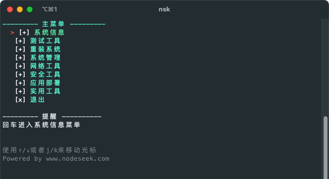

# NodeScriptKit
NodeScriptKit项目，简称nsk项目。它是
- 一个社区驱动的，命令小抄项目
- 一个可自由扩展配置，支持订阅，交互式的，服务器辅助脚本汇总集合
- 一个能够节省你大量命令/脚本查找时间的项目

## 使用方法

```
bash <(curl -sL https://sh.nodeseek.com)
```



## 主配置文件说明
- 配置文件采用[toml格式](https://toml.io/cn/v1.0.0)，可以使用[vscode](https://code.visualstudio.com/)配合[Even Better TOML](https://marketplace.visualstudio.com/items?itemName=tamasfe.even-better-toml)插件或者一些[在线编辑器](https://www.toml-lint.com/)编辑
- nsk的主配置文件默认位于/etc/nsk/config.toml
- 常用的配置入口包括[local]和[remote]，分别代表本地模块文件和远程订阅文件，本地和远程都可以合并/覆盖配置
- 合并配置toml解析后的对象合并，而非文本拼接
- 本地配置文件支持通配符，对匹配到的文件按文件名[自然排序](https://github.com/facette/natsort)后导入
- 默认`/etc/nsk/modules.d/default/*.toml`为官方模块，更新时会清空内容后再更新
- 默认`/etc/nsk/modules.d/extend/*.toml`为用户模块，更新菜单时不会清空内容
- 支持订阅，多个订阅链接会并发加载

## 模块配置文件说明
模块配置是用户打交道比较多的地方，内容包括脚本和菜单，菜单可以指向子菜单（们）和脚本

### 脚本示例
```
[scripts]
# 脚本集合，键值对
memory = "free -h"
disk = "df -hT"
cpuinfo = "cat /proc/cpuinfo"
whoami = "whoami"

hello = "echo \"hello world\""
yabs = "curl -sL yabs.sh | bash"
docker = "bash <(curl -sL 'https://get.docker.com')"

test = "echo '这是一个测试项'"
```

脚本部分比较简单，是一系列键值对，一个键对应一个字符串的值

### 菜单示例

```
[[menus]]
id = "main"
title = "主菜单"
sub_menus = [
    "info",
    "tool",
    "test"
]

[[menus]]
id = "info"
title = "系统信息"
sub_menus = [
    "cpu",
    "memory",
    "disk",
    "current-user",
]

[[menus]]
id = "test"
title = "测试项"
script = "test"
```

如上面所示，main菜单是入口菜单，有3个子菜单，其中info子菜单有进一步的子菜单，而test菜单没有下级，直接指向id为test的脚本

这些菜单id负责穿针引线，落叶归根到脚本id

## 代码提交规范和约定
- 鼓励开发者通过pr贡献内容
- 提交的内容主要包括菜单和脚本，菜单放到modules.d下，脚本放到shell_scripts下
- 菜单类要以3位数字开头，安装优先级排序，数值大的内容可以合并/覆盖数值小的
- 脚本类尽量在文件开头写明代码脚本描述，可以参考这个[模板文件](./shell_scripts/example.v0.0.1.0417.sh)
- 脚本尽量使用交互式调用

## 社区公约&开发指南
- [社区公约](./Development.md)
- [开发指南](./Rules.md)